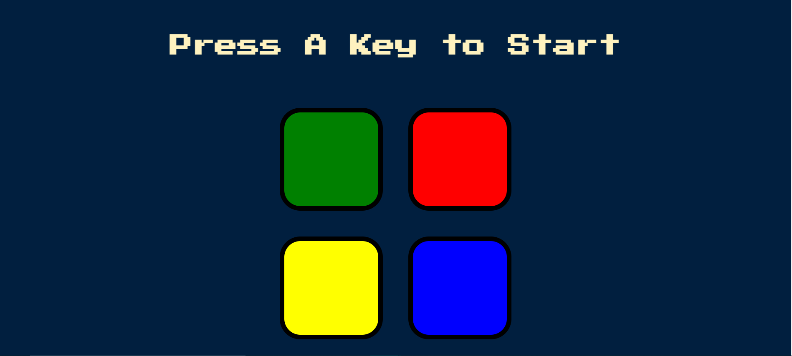
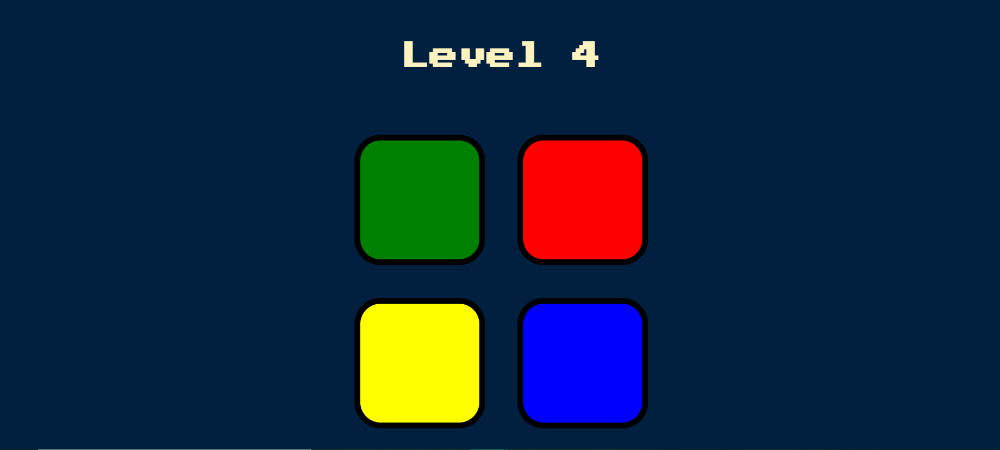
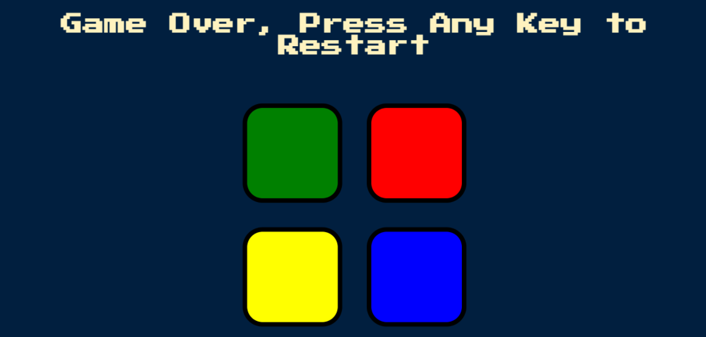

# Simon-Game
The user has to press the buttons as shown by the game in order to keep playing and progress to higher levels.

# Technologies used

1. HTML
2. JAVASCRIPT
3. CSS

# Screenshots

<h1>Hello</h1>
